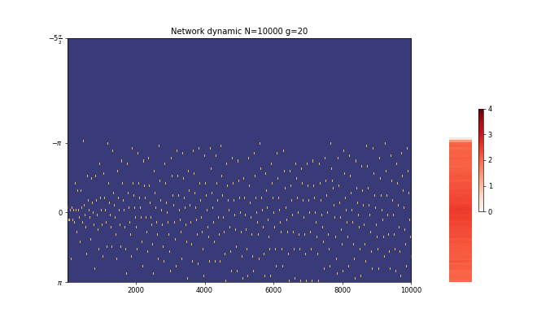
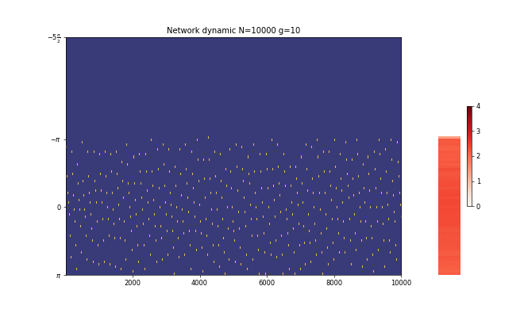

# Neurons in sync
## (Markovian approch toward modeling networks of spiking neurons)

In this project we have studied how the strength of connectivity between neurons pairs will control the phase transition.

## Dynamics of the neurons

We have used mean-field approximation in order of simulation. In other words, the network is fully connected and each neuron is free to influence all the present neurons or even get influenced by so.

## Synchronized phase
The following animation shows how the total population of neurons got synchronized by choice of corresponding value of connecitivity.

  

## Insynchronized phase
When the conncetivity is low, neurons walks around almost ignoring the other exisiting ones.

  

## Source codes
you may have your own produced animation from this [python code](https://github.com/mmehrani/master_thesis/blob/main/scripts/all_neurons_model_in_one_place/network_dynamics_animation_imshow.py).
